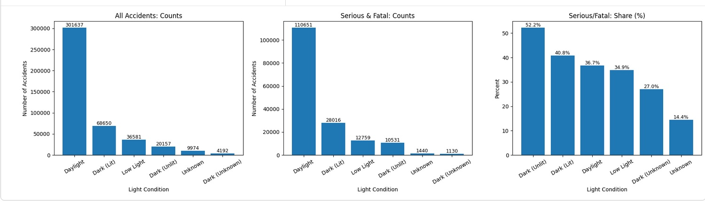
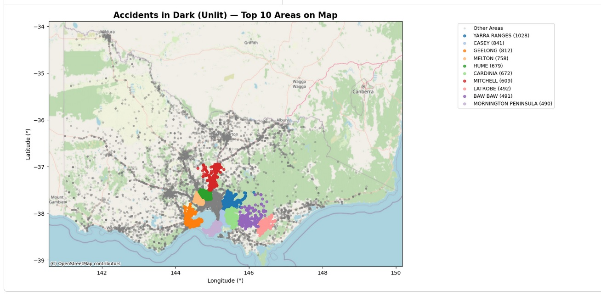
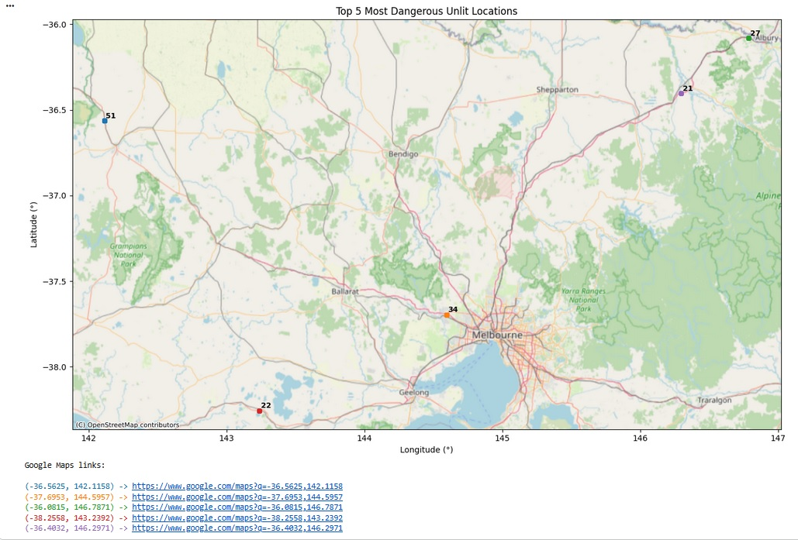
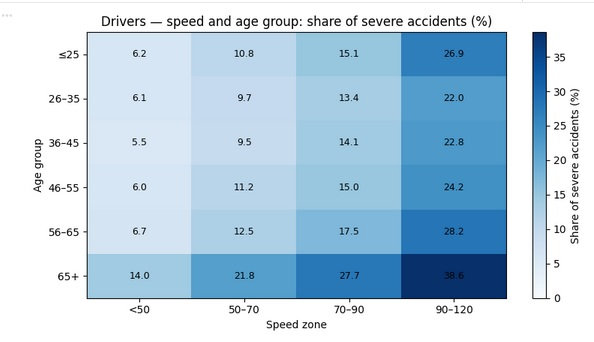
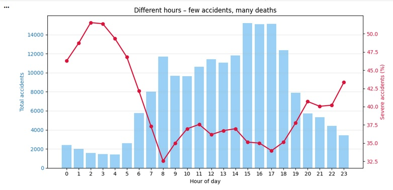

# Road Crash Analysis – Data Science Project (Erasmus+, Politecnico di Milano)

Projekt został zrealizowany podczas wymiany Erasmus+ na Politecnico di Milano, w ramach kursu poświęconego praktycznym zastosowaniom analizy danych oraz metod uczenia maszynowego.  
Celem pracy była szczegółowa analiza danych dotyczących wypadków drogowych w stanie Victoria (Australia) oraz identyfikacja różnych czynników środowiskowych, infrastrukturalnych i behawioralnych wpływających na ciężkość obrażeń uczestników zdarzeń.

Projekt obejmował pełny proces data-science: od integracji danych pochodzących z wielu źródeł, poprzez czyszczenie, preprocessing i eksploracyjną analizę danych, aż po inżynierię cech oraz budowę modeli predykcyjnych.  
Dane wymagały połączenia informacji o warunkach atmosferycznych, stanie nawierzchni oraz cechach uczestników ze szczegółowymi danymi o samych wypadkach co wiązało się z koniecznością starannego obchodzenia się z danymi niejednorodnymi i częściowo niekompletnymi.

W ramach EDA przeanalizowano zależności pomiędzy warunkami pogodowymi, oświetleniem, typem drogi, ograniczeniami prędkości oraz rolami kierowców a ciężkością obrażeń. Wykorzystano liczne metody wizualizacji i analizy statystycznej, aby ujawnić wzorce i zależności mające znaczenie dla bezpieczeństwa drogowego.  
Następnie zbudowano model klasyfikacyjny Random Forest służący do przewidywania stopnia obrażeń, a jego jakość oceniono m.in. za pomocą accuracy, precision, recall, balanced accuracy oraz analizy istotności cech.

Projekt dostarczył praktycznego doświadczenia w pracy z rzeczywistymi danymi, współpracy w zespole projektowym oraz zastosowaniu metod uczenia maszynowego w kontekście problemu o dużym znaczeniu społecznym i infrastrukturalnym.

## Cele projektu

- połączenie i ujednolicenie danych pochodzących z różnych źródeł (warunki atmosferyczne, stan nawierzchni, informacje o uczestnikach, szczegóły zdarzenia), tak aby stworzyć kompletny i spójny zbiór do analizy,
- przeprowadzenie eksploracyjnej analizy danych (EDA) w celu identyfikacji kluczowych wzorców, anomalii oraz zależności między czynnikami środowiskowymi, infrastrukturalnymi i behawioralnymi,
- opracowanie i przetestowanie modelu predykcyjnego oceniającego prawdopodobieństwo wystąpienia poważnych obrażeń w wypadkach drogowych, z wykorzystaniem technik uczenia maszynowego,
- interpretacja wyników oraz prezentacja najważniejszych wniosków dotyczących czynników wpływających na bezpieczeństwo drogowe.

## Dane

Wykorzystane zbiory:

- `victorian_road_crash_data.csv`  
- `atmospheric_cond.csv`  
- `person.csv`  
- `road_surface_cond.csv`  

Zbiory połączono kluczem `ACCIDENT_NO`.

---

# Wizualizacje i analiza eksploracyjna (EDA)

W ramach eksploracyjnej analizy danych przygotowano zestaw wizualizacji pokazujących kluczowe zależności w danych dotyczących wypadków drogowych.  
Wykresy przedstawiają wpływ warunków środowiskowych, infrastruktury oraz czynników behawioralnych na liczbę zdarzeń oraz poziom obrażeń uczestników.  

### Wpływ warunków oświetleniowych na liczbę i ciężkość wypadków  

Powyższa wizualizacja przedstawia zestawienie liczby wypadków drogowych w różnych warunkach oświetleniowych oraz udział wypadków poważnych i śmiertelnych (Serious & Fatal). Wykres podzielony jest na trzy części:

#### **1. All Accidents – ogólna liczba wypadków**
Najwięcej zdarzeń drogowych ma miejsce w świetle dziennym. Wynika to z faktu, że ruch drogowy jest wtedy zdecydowanie największy.  
W warunkach nocnych — zarówno na drogach oświetlonych, jak i nieoświetlonych — wypadków jest znacznie mniej, co odzwierciedla niższe natężenie ruchu.

#### **2. Serious & Fatal – liczba wypadków poważnych i śmiertelnych**
Podobnie jak w poprzednim przypadku, najwięcej poważnych zdarzeń występuje za dnia ale wynika to z ogólnej dominacji liczbowej.  
Ciekawa różnica pojawia się przy zdarzeniach nocnych: mimo mniejszej liczby wypadków, udział poważnych i śmiertelnych przypadków rośnie.

#### **3. Serious/Fatal Share (%) – udział procentowy najcięższych wypadków**
W tej części widać najważniejszy wniosek z całego wykresu.  
Procentowy udział poważnych obrażeń jest najwyższy w warunkach:

- **Dark (Unlit) – 52.2%**  
- **Dark (Lit) – 40.8%**  
- **Daylight – 36.7%**  
- **Low Light – 34.9%**  
- **Dark (Unknown) – 27%**  
- **Unknown – 14.4%**

Warunki „Dark (Unlit)” oraz „Dark (Lit)” mają wyraźnie większy udział zdarzeń poważnych, mimo że całkowita liczba wypadków jest tam niższa.

---

### **Wnioski**
- Warunki oświetleniowe są jednym z kluczowych czynników związanych z ciężkością wypadków drogowych.  
- Choć w dzień wypadków jest najwięcej, to noc — szczególnie na drogach **nieoświetlonych** — znacząco zwiększa prawdopodobieństwo poważnych lub śmiertelnych obrażeń.  

### Lokalizacja wypadków w warunkach „Dark (Unlit)” — top 10 obszarów  

Powyższa mapa przedstawia przestrzenną dystrybucję wypadków drogowych, które miały miejsce w warunkach słabego oświetlenia z wyróżnieniem dziesięciu obszarów o największej liczbie takich zdarzeń. Punkty w tle (ciemnoszare) symbolizują pozostałe wypadki w całym stanie Victoria, natomiast kolorowe regiony reprezentują obszary o najwyższych liczbach incydentów w nieoświetlonych warunkach nocnych.

#### **Najbardziej narażone obszary (Top 10):**
1. **Yarra Ranges (1028)**  
2. **Casey (841)**  
3. **Geelong (812)**  
4. **Melton (758)**  
5. **Hume (679)**  
6. **Cardinia (672)**  
7. **Mitchell (609)**  
8. **Latrobe (492)**  
9. **Baw Baw (491)**  
10. **Mornington Peninsula (490)**  

---

### **Interpretacja**
- Wypadki w warunkach *Dark (Unlit)* koncentrują się w rejonach położonych na obrzeżach Melbourne oraz w bardziej rozproszonych, półwiejskich częściach stanu Victoria.  
- Obszary takie jak **Yarra Ranges, Casey, Geelong czy Melton** wykazują szczególnie wysoką liczbę tego typu wypadków.  
- Regiony te charakteryzują się często większym udziałem dróg o ograniczonej widoczności, mniejszym oświetleniem infrastrukturalnym oraz wyższymi limitami prędkości 

---

### **Wnioski**
- Warunki słabego oświetlenia mają znaczący wpływ na ryzyko wypadków, szczególnie w obszarach oddalonych od centrum Melbourne.  
- Analiza przestrzenna wskazuje, że brak oświetlenia drogowego oraz rozproszony układ dróg mogą zwiększać prawdopodobieństwo wypadków.  
- Działania infrastrukturalne (doświetlenie dróg, lepsza sygnalizacja, ograniczenie prędkości w wybranych strefach) mogłyby przynieść realną poprawę bezpieczeństwa.  

### 5 najniebezpiecznych miejsc w warunkach słabego oświetlenia 

Powyższa wizualizacja przedstawia pięć najbardziej niebezpiecznych lokalizacji w stanie Victoria, w których odnotowano najwyższą liczbę wypadków w warunkach nocnych bez oświetlenia. Każdy punkt na mapie reprezentuje lokalizację geograficzną o szczególnie wysokiej koncentracji takich zdarzeń, a liczby obok punktów odpowiadają liczbie wypadków w danym miejscu.

### **Co pokazuje wykres**
- Mapa oparta jest na danych geograficznych z OpenStreetMap, co umożliwia precyzyjne odwzorowanie położenia wypadków.  
- Najbardziej niebezpieczne lokalizacje zostały oznaczone punktami wraz z liczbą zdarzeń (np. **51**, **34**, **27** itp.).  
- Pod mapą znajdują się generowane automatycznie linki do Google Maps, które pozwalają na dokładne sprawdzenie lokalizacji w terenie.

### **Interpretacja wyników**
1. **Zagrożenia nie są równomiernie rozmieszczone**  
   Wypadki w warunkach słabego oświetlenia koncentrują się w kilku specyficznych punktach — często wzdłuż głównych dróg międzymiastowych, gdzie widoczność jest ograniczona, a prędkości wyższe.

2. **Najbardziej niebezpieczne miejsca znajdują się poza centrum Melbourne**  
   Większość z nich leży na terenach wiejskich lub półwiejskich co sugeruje, że brak oświetlenia w połączeniu z prostymi, słabo nadzorowanymi odcinkami drogi zwiększa ryzyko zdarzeń.

3. **Wysokie natężenie wypadków w tych punktach może wynikać z charakterystyki infrastruktury**  
   Możliwe przyczyny:  
   - brak oświetlenia ulicznego na długich odcinkach,  
   - wysokie limity prędkości,  
   - ograniczona widoczność zakrętów i skrzyżowań,  
   - lokalizacje w pobliżu przejść między drogami głównymi a lokalnymi.

4. **Powtarzalność zdarzeń sugeruje problem strukturalny**  
   Jeżeli w konkretnym punkcie występuje kilkadziesiąt wypadków, to jest to sygnał, że infrastruktura wymaga przeglądu — np. doświetlenia, zmian w geometrii drogi lub dodatkowego oznakowania.

### Accidents by Driver Age Group  

Wizualizacja przedstawia liczbę wszystkich wypadków oraz udział wypadków ciężkich (serious + fatal) w zależności od wieku kierowców.

**Najważniejsze obserwacje:**

- Najwięcej wypadków powodują kierowcy w wieku **26–35 lat** oraz **≤25 lat**, co jest spójne z najwyższym natężeniem ruchu w tych grupach wiekowych.  
- Grupy wiekowe **56–65** oraz **65+** charakteryzują się mniejszą liczbą wypadków ogółem, ale znacznie **wyższym udziałem wypadków poważnych**.  
- W szczególności kierowcy **65+** mają najwyższy procent ciężkich zdarzeń — około 24–25%, co wskazuje na większą podatność na poważne obrażenia.

**Wniosek:**  
Młodsi kierowcy odpowiadają za większą liczbę wypadków, natomiast starsi kierowcy są bardziej narażeni na poważne skutki wypadków. Analiza podkreśla potrzebę zróżnicowanego podejścia do bezpieczeństwa ruchu drogowego w zależności od profilu wiekowego kierowców.

### Severe Accidents by Age Group and Speed Zone (Heatmap)  

Heatmapa przedstawia udział wypadków poważnych (serious + fatal) w zależności od wieku kierowcy i obowiązującego limitu prędkości.

**Najważniejsze obserwacje:**

- W każdej grupie wiekowej udział ciężkich wypadków rośnie wraz z limitem prędkości.  
- Najbardziej ryzykowne są strefy **90–120 km/h**, gdzie udział wypadków poważnych osiąga:
  - **26–27%** dla kierowców młodych i w średnim wieku,  
  - ponad **38%** dla kierowców **65+**.
- Kierowcy **65+** są najbardziej narażeni — ich ryzyko ciężkich obrażeń rośnie gwałtownie wraz z prędkością, nawet w strefach 70–90 km/h.

**Wniosek:**  
Prędkość i wiek kierowcy są ze sobą powiązane, im wyższa prędkość i im starsza grupa wiekowa, tym większe ryzyko ciężkich obrażeń. Wynik podkreśla znaczenie dostosowania limitów prędkości oraz edukacji kierowców.

### Hourly Accident Patterns — Few Accidents but High Severity  

Wykres przedstawia zależność między całkowitą liczbą wypadków (słupki) a udziałem wypadków poważnych (linia) w poszczególnych godzinach doby.

**Najważniejsze obserwacje:**

- Najwięcej wypadków występuje w godzinach popołudniowych (14:00–17:00), co odpowiada największemu natężeniu ruchu.  
- Najwyższy procent poważnych wypadków przypada na godziny nocne — **1:00–4:00**, mimo że ogólna liczba zdarzeń jest tam niska.  
- W godzinach 7:00–8:00 udział poważnych wypadków gwałtownie spada, co pokrywa się z początkiem porannego szczytu.  
- Wieczorne godziny (20:00–23:00) znów wykazują wyższy udział ciężkich zdarzeń, mimo umiarkowanej liczby wypadków.

**Wniosek:**  
Ryzyko ciężkich obrażeń nie zależy wyłącznie od liczby wypadków.  
Godziny nocne i późnowieczorne charakteryzują się znacznie wyższym udziałem wypadków poważnych, co może wynikać m.in. ze zmęczenia kierowców, gorszej widoczności i większej prędkości jazdy przy niższym natężeniu ruchu.

# Analiza i modelowanie

Celem tej części projektu było zbadanie, w jaki sposób różne czynniki środowiskowe, infrastrukturalne i czasowe wpływają na prawdopodobieństwo wystąpienia wypadku śmiertelnego. W tym celu zbudowano dwa klasyfikatory: **Logistic Regression** oraz **Random Forest**, korzystając z jednolitego procesu przygotowania danych i tych samych cech wejściowych.

---

## Przygotowanie danych (preprocessing)

Modelowanie przeprowadzono na danych zawierających komplet niezbędnych informacji.  
Z tego powodu usunięto obserwacje z brakami w następujących kolumnach:

- `LIGHT_CONDITION`  
- `ROAD_GEOMETRY`  
- `SPEED_ZONE`  
- `ACCIDENT_TIME`  
- `LGA_NAME`  
- `DAY_OF_WEEK`  
- `ATMOSPH_COND_DESC`  
- `SURFACE_COND_DESC`  
- `FATALITY`

Dodatkowo, czas zdarzenia (`ACCIDENT_TIME`) przetworzono na **wartość liczbową HOUR_FLOAT**:

- godzina + (minuty / 60)

Dzięki temu cecha czasu może być użyta przez modele ML.

### Zmienne wejściowe (X)
- 'LIGHT_CONDITION',
- 'ROAD_GEOMETRY',
- 'SPEED_ZONE',
- 'HOUR_FLOAT',
- 'LGA_NAME',
- 'DAY_OF_WEEK',
- 'ATMOSPH_COND_DESC',
- 'SURFACE_COND_DESC'.

### Zmienna docelowa (y)
Wypadki śmiertelne zakodowano binarnie:
- `0` – brak ofiar śmiertelnych  
- `1` – ≥1 ofiara śmiertelna  

### Transformacja cech
Wszystkie zmienne potraktowano jako kategoryczne (w tym `HOUR_FLOAT`) i przekształcono za pomocą:

- **OneHotEncoder(handle_unknown='ignore')**

### Podział danych

Dane podzielono na zbiór treningowy i testowy w proporcji **80/20** z wykorzystaniem parametru stratify=y, który gwarantuje zachowanie proporcji rzadkiej klasy „fatal” (ok. 1,7%) zarówno w zbiorze treningowym, jak i testowym.

---

## Model 1 — Logistic Regression

Regresja logistyczna została wykorzystana jako **model bazowy**.  
Model umieszczono w pipeline razem z **OneHotEncoder**, co pozwoliło na przetwarzanie zmiennych kategorycznych oraz zapewniło spójny preprocessing całego zbioru.

### **Wyniki modelu**

- **Accuracy:** 0.98  
- **Precision (fatal):** 0.47  
- **Recall (fatal):** 0.02  
- **Balanced Accuracy:** ~0.51  

### **Confusion Matrix**
- 86605
- 32
- 1539
- 28

### **Interpretacja wyników**

- Model **nie wykrywa przypadków śmiertelnych** (recall = 0.02).  
- Powodem jest **silne niezbalansowanie klas** (fatal accidents ≈ 1.7%).  
- Jako model liniowy, Logistic Regression **nie odwzorowuje nieliniowych zależności** między cechami, takich jak:
  - prędkość × oświetlenie,  
  - warunki atmosferyczne × geometria drogi,  
  - pora dnia × stan nawierzchni.

➡ **Wniosek:** Logistic Regression nie sprawdza się w praktycznej predykcji wypadków śmiertelnych.

---
## Model 2 — Random Forest Classifier

Zastosowano Random Forest z parametrami:
- `n_estimators=100`  
- `class_weight='balanced'` (kluczowe!)  
- `bootstrap=True, oob_score=True`  
- `n_jobs=-1`

### **Wyniki modelu**

- **Accuracy:** 1.00  
- **Precision (fatal):** 0.94
- **Recall (fatal):** 0.80  
- **Balanced Accuracy:** ~0.8987  

### **Confusion Matrix**
- 86559
- 78
- 316
- 1251

### Interpretacja wyników
- **Recall = 0.80** oznacza, że model wykrywa większość wypadków śmiertelnych.  
- **Balanced accuracy ≈ 0.90** wyraźnie przewyższa wynik regresji logistycznej (0.51).  
- Random Forest potrafi uchwycić **nieliniowe zależności** i interakcje między cechami:  
  - wysoka prędkość × noc × brak oświetlenia  
  - deszcz × zakręt × prędkość  
  - wiek × lokalizacja × pogoda  

Wniosek: **Random Forest zdecydowanie przewyższa regresję logistyczną** i jest skutecznym modelem w przewidywaniu wypadków śmiertelnych.
---
## Podsumowanie modelowania

- **Random Forest osiągnął najwyższą skuteczność** – balanced accuracy ≈ 0.90.  
- Największy wpływ na śmiertelne zdarzenia mają czynniki środowiskowe i infrastrukturalne.  
- Logistic Regression działa jako baseline, ale nie nadaje się do praktycznej predykcji przypadków śmiertelnych.

---
## Rola w zespole

Projekt zrealizowany był w 4-osobowym zespole.

**Mój wkład:**

- przygotowanie i łączenie danych,  
- część EDA i wizualizacji,  
- udział w budowie i ocenie modelu,  
- współtworzenie wniosków i podsumowania.

---

## Podsumowanie

Projekt obejmuje pełny proces data-science: od surowych danych, przez wizualizacje i analizę, aż po model predykcyjny.  
Wyniki wskazują m.in. istotny wpływ prędkości, liczby uczestników i warunków oświetleniowych na powagę obrażeń.
